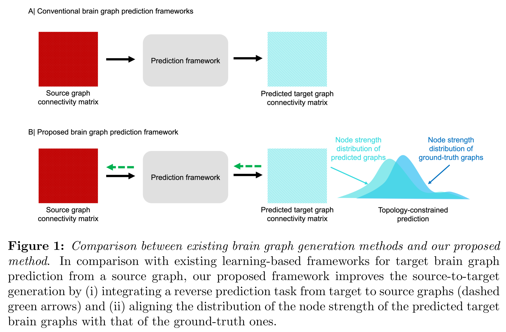
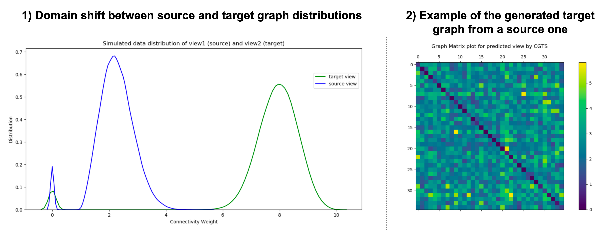

# CGTS-GAN
CGTS-GAN for topology-guided cyclic graph generation, coded up in Python by Abubakhari Sserwadda (abubakhari@gmail.com).




> **Topology-Guided Cyclic Brain Connectivity Generation using Geometric Deep Learning
**<br/>
> [Abubakhari Sserwadda]<sup>1</sup>,[Islem Rekik](https://basira-lab.com/)<sup>1</sup><br/>
> <sup>1</sup>BASIRA Lab, Faculty of Computer and Informatics, Istanbul Technical University, Istanbul, Turkey<br/>
>
> **Abstract:** *There is a growing need for analyzing medical data such as brain connectomes. However, the unavailability of large-scale training samples increases risks of model over-fitting. Recently, deep learning (DL) architectures quickly gained momentum in synthesizing medical data. However, such frameworks are primarily designed for Euclidean data (eg., images), overlooking geometric data (eg., brain connectomes). A few existing geometric DL works that aimed to predict a target brain connectome from a source one primarily focused on domain alignment and were agnostic to preserving the connectome topology. To address the above limitations, firstly, we adapt the graph translation generative adversarial network (GT GAN) architecture to brain connectomic data. Secondly, we extend the baseline GT GAN to a cyclic graph translation (CGT) GAN, allowing bidirectional brain network translation between the source and target views. Finally, to preserve the topological strength of brain regions of interest (ROIs), we impose a topological strength constraint on the CGT GAN learning, thereby introducing CGTS GAN architecture. Our deep graph network outperformed the baseline comparison method and its ablated versions in mean squared error (MSE) using multiview autism spectrum disorder connectomic dataset. We designed a topology-aware bidirectional brain connectome synthesis framework rooted in geometric deep learning, which can be used for data augmentation in clinical diagnosis.*

## Dependencies

The code has been tested with Python 3.6.7, Conda version 4.8.3 and TensorFlow 1.9.0 on both Ubuntu 18.04 and windows 10. The code runs on both CPU and GPU. You also need some of the following Python packages, which can be installed via pip:

numpy

pandas

scikit-learn 

Scipy


## Code Demo

In order to use our framework, you need to provide: a set of source and target graph matrices, each of size (n * m * m).  n denotes the total number of subjects in the dataset and m the number of features.

In the file simulated_data.py, we simulate data for the usage of our framework for target graph prediction from a source graph. The dataset has 150 subjects and each with 35 ROIs (similar to the connectomic data we used in our paper).

run simulated_data.py to generate source and target views
 
run main.py for training and testing 

The framework trains once and predicts in both directions simultaneously. 
 
Invoking test function prompts the first directional translation prediction (i.e., a to b). 
 
Invoking test2 function prompts the second directional translation prediction(i.e., b to a).




# Related references
Deep Graph Translation: 

Guo, X., Wu, L., Zhao, L., 2018. Deep graph translation. [https://arxiv.org/abs/1805.09980] (2018) [https://github.com/anonymous1025/Deep-Graph-Translation-].

Hierarchical adversarial connectomic domain alignment for target brain graph prediction and classification from a source graph:

Bessadok, A., Mahjoub, M.A., Rekik, I., 2019a. Hierarchical adversarial connectomic domain alignment for target brain graph prediction and classification from a source graph. [https://www.researchgate.net/publication/336430159_] (2019) [https://github.com/basiralab/HADA/].


# Please cite the following paper when using CGTS-GAN:

```latex
@article{sserwadda2020topology,
  title={Topology-Guided Cyclic Brain Connectivity Generation using Geometric Deep Learning},
  author={Sserwadda, Abubakhari and Rekik, Islem},
  journal={Journal of Neuroscience Methods},
  pages={108988},
  year={2020},
  publisher={Elsevier}
}
```

Paper can be downloaded at: https://www.researchgate.net/publication/344805122_Topology-Guided_Cyclic_Brain_Connectivity_Generation_using_Geometric_Deep_Learning

# License
Our code is released under MIT License (see LICENSE file for details).
